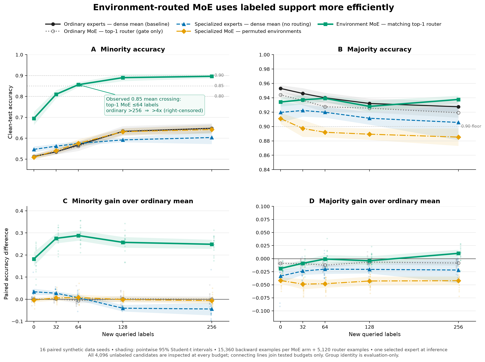

# ssilite

A PyTorch reconstruction of one narrow question:

> Can a learner jointly decide what failures define its objective, which
> examples efficiently estimate that objective's gradient, and where numerical
> precision is worth its cost?

The first prototype separated acquisition, robust weighting, sampling, and
precision. The follow-up exposed the missing variable: a scalar loss ranking
cannot recover a coherent partition. The final experiment now asks whether a
formal sparse mixture of experts, trained under deliberately different
label-free environments, can supply that structure.

This is a mechanism experiment, not evidence about SSI's private research.

## The variables

For loss `ell_i(theta)`, the original controller keeps four choices separate:

```math
a:\text{ acquire support},\qquad
q:\text{ objective weights},\qquad
p:\text{ gradient proposal},\qquad
b:\text{ numerical precision}.
```

Given a base measure `mu`, the capped entropic adversary is

```math
q_i=\min\{\mu_i/\alpha,
c\mu_i\exp((\ell_i-\ell_i^{\mathrm{ref}})/\tau)\}.
```

The proposal and unbiased quantized estimator are

```math
p_i^{\mathrm{raw}}\propto
q_i\sqrt{\lVert g_i\rVert^2+\sigma_i^2(b_i)},
```

```math
\widehat G=
\frac1B\sum_{j=1}^B
\frac{q_{I_j}}{p_{I_j}}Q_{b_{I_j}}(g_{I_j}).
```

Stochastic rounding makes `Q` conditionally unbiased. The precision allocator
buys the largest reduction in

```math
\sum_i \frac{q_i^2}{p_i}\sigma_i^2(b_i)
```

per unit expected cost.

The follow-up adds an environment assignment and a population:

```math
e_i=C(x_i),\qquad
u_i=\frac1R\sum_{r=1}^R
P_{\theta_{r,e_i,-i}}(y_i^{\mathrm{obs}}\mid x_i).
```

`C` is label-free clustering. The subscript `-i` means every score is out of
fold: the matched specialist never trained on the label it grades. The final
environment adversary operates on partitions rather than individual loss
ranks:

```math
L_k(\theta)=
\frac{\sum_{i:e_i=k}u_i\ell_i(\theta)}
{\sum_{i:e_i=k}u_i},
\qquad
\max_{r\in\mathcal U(\mathrm{Unif}(K))}
\sum_k r_k L_k(\theta).
```

The final experiment compiles that population into a formal hard-routed MoE:

```math
\widehat e(x)=\arg\max_e r_\phi(e\mid x),
\qquad
f_{\mathrm{MoE}}(x)=f_{\theta_{\widehat e(x)}}(x).
```

Cluster assignments train `r_phi` as pseudo-labels. Task batches use those
assignments for teacher-forced sparse dispatch, while the test-time route is
the router's learned top-1 choice.

## Run it

The command-line entry points default to CUDA when it is available:

```console
uv sync
uv run ssilite --device cuda
uv run ssilite-followup --seeds 0 1 2 3 4 --device cuda
uv run ssilite-reconstruction --seeds 0 1 2 3 --device cuda
uv run ssilite-sample-efficiency \
  --seeds 0 1 2 3 4 5 6 7 8 9 10 11 12 13 14 15 \
  --budgets 0 32 64 128 256 \
  --device cuda
```

`ssilite` runs the original acquisition plus `q/p/b` prototype.
`ssilite-followup` runs the corrected version of Fable's trust bootstrap.
`ssilite-reconstruction` retains the earlier independent-population
reconstruction and its identifiability controls. `ssilite-sample-efficiency`
runs the final formal-MoE experiment: one tensorized expert bank, one learned
top-1 router, and the lean nested-support curve without the out-of-fold trust
filter.

The reported experiments below used:

```text
NVIDIA GeForce RTX 4090
PyTorch 2.13.0+cu130
CUDA runtime 13.0
```

The tiny MLPs do not saturate a 4090. CUDA here establishes the executed
device, not a speedup claim.

## Verify

```console
uv run ruff check src tests
uv run ruff format --check src tests
uv run pytest -q
uv run --with mypy mypy src/ssilite
uv build
```

Current local verification: 69 tests, Ruff lint and format, Mypy, and source
plus wheel builds.

## Layout

- `acquisition.py`: label-free support expansion.
- `risk.py`: empirical CVaR and capped entropic robust weights.
- `allocation.py`: variance-aware sampling and budgeted precision.
- `quantization.py`: deterministic score and unbiased gradient quantization.
- `estimator.py`: vectorized per-example gradients.
- `controller.py`: damped `q/p/b` state.
- `bootstrap.py`: leakage-safe reconstruction of Fable's dynamics bootstrap.
- `environment_ensemble.py`: cross-fitted ordinary and environment-specialist
  students, iterative trust, and permanence control.
- `adversarial.py`: bounded dual optimization over discovered environments.
- `environment_mixture.py`: equal-compute final ordinary and routed specialist
  populations retained as the pre-MoE control.
- `environment_moe.py`: one learned router, a contiguous expert bank,
  teacher-forced specialist training, and genuine sparse top-1 dispatch.
- `sample_efficiency.py`: nested-support, matched-compute formal-MoE benchmark
  with grid-censored target crossings and per-expert routing diagnostics.
- `scripts/plot_sample_efficiency.py`: paired uncertainty plots and compact
  CSV/JSON artifact generation for every formal-MoE control.
- `experiment.py`: original support-acquisition experiment.
- `followup.py`: corrected Fable controls.
- `reconstruction.py`: paired SSI-hypothesis experiment and counterexample.

## What Fable established

Fable's exact NumPy experiments correctly killed naive sample-level DRO:

- clean rare failures and corrupted labels are both high-loss;
- a bounded uncertainty set limits damage but does not distinguish them;
- same-objective ensemble disagreement inherits the same bias;
- a self-referential grade/re-trust loop exhibits backaction;
- reweighting fixed support cannot manufacture information.

The original bootstrap also had avoidable confounds: students graded their own
training labels, tied ranks were arbitrarily ordered, and there was no damping,
permanence, common initialization table, or multi-seed control.

The PyTorch reconstruction fixes those confounds. Every label-dependent score
is repeated K-fold out of fold, ranks use average midranks, replicas and batch
streams are paired, trust moves under an explicit bound, and reversible versus
permanent distrust is selectable.

It still does not solve the problem.

Across five CUDA seeds, the corrected same-environment bootstrap produced:

| Minority accuracy | Mean | SD |
| --- | ---: | ---: |
| Raw-loss, fixed support | 0.535 | 0.044 |
| Corrected bootstrap, fixed support | 0.549 | 0.036 |
| Raw-loss, acquired support | 0.657 | 0.084 |
| Corrected bootstrap, acquired support | 0.701 | 0.051 |
| Oracle control, acquired support | 0.813 | 0.059 |

On fixed support it was a real corruption detector—AUROC
`0.891 +/- 0.026`—but assigned mean trust `0.833` to clean majority examples,
`0.573` to clean minority examples, and `0.399` to corrupt examples. It
therefore inherited the blind spot it was meant to repair. None of the ten
fixed/acquired loops converged. A seed-0 permanence run also failed the
convergence criterion after 24 rounds; permanence made the sequence monotone,
not correct or fast.

## The decisive treatment: change the students' environments

The next experiment discovers three environments from raw features, then uses
four equal-budget students:

- ordinary arm: every student sees the empirical objective;
- specialist arm: three students put 80% of their sampling mass on one
  environment each, and one uses environment-balanced sampling;
- permutation control: the same environment counts are randomly reassigned;
- all arms reuse the same folds, independent initialization seed table,
  architecture, optimizer steps, and batch budget.

The primary statistic is the observed-label confidence of the student's
matched environment. Hidden group and corruption indicators are used only
afterward for diagnostics.

Sixteen paired CUDA seeds gave:

| OOF grading arm | Clean rare minus corrupt support | Rare-vs-corrupt AUROC | Rare retained at 0.7 | Corrupt accepted at 0.7 |
| --- | ---: | ---: | ---: | ---: |
| Ordinary students | 0.316 +/- 0.052 | 0.770 +/- 0.037 | 0.457 | 0.081 |
| Environment specialists | **0.618 +/- 0.049** | **0.962 +/- 0.018** | **0.723** | **0.032** |
| Permuted environments | 0.314 +/- 0.059 | 0.759 +/- 0.041 | — | — |

The paired environment-minus-ordinary AUROC difference was `+0.192`, with a
95% interval `[+0.178, +0.207]` and exact sign-flip `p = 0.0000305`.
Environment versus permutation was `+0.203` with the same sign-flip p-value.
Each real arm used 72 fits and 184,320 backward examples per seed.

Generic ensemble rescue is not the statistic. The gap between the best student
and the population mean rose by about the same amount on clean rare and corrupt
examples. The discriminating object is *matched specialist confidence*: a
student trained in the relevant coherent environment, grading out of fold.

## Why weights and group DRO were not the result

A fresh single learner received the OOF signal under full-precision,
full-support gradients. Adaptive `p`, quantized `b`, and per-example raw-loss
DRO were disabled so they could not explain the outcome.

| Fresh single learner | Minority accuracy | Majority accuracy |
| --- | ---: | ---: |
| Ordinary-ensemble trust | 0.820 +/- 0.028 | 0.881 +/- 0.016 |
| Specialist trust | 0.828 +/- 0.026 | 0.881 +/- 0.014 |
| Static equal-environment objective | 0.826 +/- 0.024 | 0.875 +/- 0.015 |
| Environment adversary | 0.826 +/- 0.026 | 0.885 +/- 0.016 |
| Oracle environment/noise control | 0.878 +/- 0.021 | — |

Specialist trust improved minority accuracy by only `0.79` points over ordinary
trust, with a 95% interval `[+0.07, +1.50]`. Static balancing and the dynamic
environment adversary were not significantly better than ordinary trust.

The signal was real, but collapsing the population back into one set of
weights discarded most of it.

## Pre-MoE intermediate: keep the population alive

Before compiling the mechanism into one model, an intermediate test trained
equal-compute independent populations and evaluated five causal arms:

- ordinary students, probability averaged;
- ordinary students, routed through the same gate;
- specialists, naively averaged;
- specialists, routed to the nearest discovered environment;
- specialists trained and routed on size-preserving permuted environments.

Both real final populations receive the same OOF trust filter. Their
initialization seeds, batch streams, model count, and optimizer budget are
identical: four fits and 20,480 backward examples per arm.

Across 16 paired CUDA seeds:

| Final population | Minority | Majority | Overall | Balanced log loss |
| --- | ---: | ---: | ---: | ---: |
| Ordinary mean | 0.648 +/- 0.039 | 0.916 +/- 0.017 | 0.782 | 0.493 |
| Ordinary routed | 0.637 +/- 0.037 | 0.907 +/- 0.017 | 0.772 | 0.525 |
| Specialist mean | 0.622 +/- 0.029 | 0.913 +/- 0.015 | 0.768 | 0.445 |
| Permuted specialist routed | 0.631 +/- 0.045 | 0.890 +/- 0.018 | 0.761 | 0.563 |
| **Real specialist routed** | **0.893 +/- 0.021** | **0.940 +/- 0.010** | **0.916** | **0.200** |

Real routed specialists beat ordinary averaging by `+24.46` minority points,
95% interval `[+22.29, +26.63]`, and `+2.40` majority points. They beat the
permuted routed specialists by `+26.12` minority points. Exact paired sign-flip
p-values were `0.0000305`.

Ordinary student predictions had mean correlation `0.968`; specialist
predictions had correlation `0.607`. Averaging those specialists was worse,
because it recombined incompatible mechanisms. The useful unit is the pair
`(specialist, environment gate)`, not diversity in isolation.

These small final students are an equal-compute causal comparison with one
another. Their absolute accuracies should not be compared directly with the
larger two-hidden-layer model in `experiment.py`.

## Quantifying label efficiency

The clean curve now uses a formal MoE rather than an ensemble. Each arm is one
`nn.Module` with three experts stored in contiguous parameter tensors, one
learned linear router, one optimizer, and hard top-1 sparse inference. Feature
clustering supplies pseudo-labels to the router. During task training those
same IDs teacher-force dispatch, so a randomly initialized router cannot starve
an expert before specialization begins.

At every step each expert receives 64 examples. The task loss is

```math
\mathcal L_{\mathrm{task}}=
\sum_{e=1}^{3}
\frac{1}{64}\sum_{j=1}^{64}
\ell(f_{\theta_e}(x_{e,j}),y_{e,j}),
```

and a separate environment-balanced batch trains the router. Every arm uses 80
physical optimizer steps, 240 logical expert updates, 15,360 task examples,
and 5,120 router examples. Counting both objectives gives the same 20,480
gradient-bearing examples as the earlier four-fit population, but the deployed
path evaluates only one selected expert.

For each of 16 paired CUDA data seeds, the benchmark creates one 256-point
acquisition ordering and reuses nested prefixes. Ordinary and specialized MoEs
see identical labeled support, initialization, router batches, and random
streams. Environment discovery sees raw features but no labels. Rare-group and
clean-label fields are used only after training for evaluation.



[Vector figure](artifacts/sample_efficiency_variants.svg),
[summary data](artifacts/sample_efficiency_variants.csv), and
[paired seed-level results](artifacts/sample_efficiency_variants.json) are
included. The bottom panels subtract the ordinary dense mean within the same
seed and budget before computing uncertainty.

The five controls identify a conjunction, not a bagging effect:

| Arm at 64 new labels | Minority | Majority |
| --- | ---: | ---: |
| Ordinary experts, dense mean | 0.568 | 0.940 |
| Ordinary MoE, learned router only | 0.562 | 0.927 |
| Specialized experts, dense mean only | 0.575 | 0.920 |
| Specialized MoE, permuted environments | 0.576 | 0.892 |
| **Specialized MoE, matching environments** | **0.856** | **0.939** |

The matching MoE improves minority accuracy over the ordinary baseline by
`+0.288`, with paired 95% interval `[+0.265, +0.312]`; every one of the 16
paired differences is positive. Gate-only, specialization-only, and a
size-preserving arbitrary partition all remain near zero.

| New label queries | Total labels | Rare among queries | Total rare support | Ordinary minority | MoE minority | MoE 95% CI |
| ---: | ---: | ---: | ---: | ---: | ---: | ---: |
| 0 | 512 | 0.0 | 24.88 | 0.513 +/- 0.017 | 0.695 +/- 0.060 | [0.663, 0.727] |
| 32 | 544 | 32.0 | 56.88 | 0.535 +/- 0.023 | 0.810 +/- 0.037 | [0.790, 0.830] |
| 64 | 576 | 64.0 | 88.88 | 0.568 +/- 0.030 | 0.856 +/- 0.022 | [0.844, 0.868] |
| 128 | 640 | 125.88 | 150.75 | 0.633 +/- 0.030 | 0.890 +/- 0.031 | [0.873, 0.907] |
| 256 | 768 | 167.13 | 192.00 | 0.648 +/- 0.036 | 0.896 +/- 0.018 | [0.887, 0.906] |

The `+/-` values are sample standard deviations across data seeds. The final
column is a two-sided Student `t(15)` interval for mean minority accuracy.
The routed MoE's mean majority accuracy stayed between `0.928` and `0.939`.

The individual expert result is the sharper proof that this is an MoE. At 64
queries, the expert receiving the most rare routes independently reached
`0.865 +/- 0.021` minority accuracy, with interval `[0.854, 0.876]`, but only
`0.572` majority accuracy. The router sent `97.72%` of rare examples to that
expert and only `0.25%` of majority examples there. It did not average weak
generalists into a strong classifier; it learned a local rule and routed the
right inputs to it.

For a minority target `tau` and a `0.90` majority floor, define the
mean-over-generator grid complexity

```math
B_m(\tau)=
\inf\{B:
\mathbb E[A_{\mathrm{minority},m}(B)]\ge\tau,\quad
\mathbb E[A_{\mathrm{majority},m}(B)]\ge0.90\}.
```

The ordinary curve never reaches even `0.80`, so its result is right-censored:
there is no honest finite point estimate. The observed mean grid gives lower
bounds.

| Target minority mean | MoE grid crossing | Ordinary grid censoring | New-label efficiency | Total-label efficiency | Rare-support efficiency |
| ---: | ---: | ---: | ---: | ---: | ---: |
| 0.80 | <=32 | >256 | **>8x** | **>1.41x** | **>3.38x** |
| 0.85 | <=64 | >256 | **>4x** | **>1.33x** | **>2.16x** |

At the `0.85` target, the MoE mean is `0.856` at 64 queries while the ordinary
mean is only `0.648` at four times the new-label budget. Ten of sixteen MoE
seeds meet the joint `0.85/0.90` target at 64 queries, 15 of 16 at 128, and all
16 at 256; no ordinary seed meets it anywhere on the grid.

The table is a mean-curve point estimate. The plotted intervals are pointwise
and cannot justify selecting a crossing after looking. With a conservative
two-sided Bonferroni correction across all five budgets, the routed 64-query
minority lower bound is `0.840`, below the `0.85` target. At 128 queries its
minority and majority lower bounds are `0.867` and `0.917`, while the ordinary
256-query minority upper bound is `0.675`. Thus the inference-conservative
statement is **greater than 2x** new-label efficiency at the `0.85` target; the
greater-than-4x row is the right-censored mean-curve estimate.

There are two different gains:

- **Acquisition:** the first 64 queried points were all rare, a `19.78x` mean
  enrichment over their prevalence in the realized reservoir.
- **Use of support:** the mean MoE curve reaches `0.85` with 88.88 mean rare
  examples; under the simultaneous bound it needs 150.75. The ordinary arm
  fails with 192.

And there are two costs the label ratio omits:

- every run inspects all 4,096 candidate feature vectors, or 64 observations
  per acquired label at the 64-query point;
- equal gradient-bearing example counts are not equal total FLOPs: clustering,
  routing, and dense diagnostic forwards remain additional work.

Thus `>2x` is the conservative MoE learning number for the `0.85` target,
`>4x` is its observed mean-curve estimate, and `19.78x` is a separate
pool-based acquisition number. If observing a candidate costs an environment
interaction, the latter is not an RL sample-efficiency gain. The MoE uses
support efficiently; it does not create support.

Kimi's recent systems result changes the engineering plausibility, not this
experiment's evidence. The [Kimi K3 report](https://arxiv.org/abs/2607.24653)
uses far more elaborate Stable LatentMoE machinery, while
[MoonEP](https://github.com/MoonshotAI/MoonEP) balances expert-parallel work
across multiple accelerator ranks. This prototype implements neither. On one
RTX 4090 there is no cross-rank expert-parallel bottleneck to solve. What does
transfer is the systems contract: contiguous expert weights, explicit route
plans, selected-expert execution, load telemetry, and no dropped examples.

Reproduce the figure and its raw data with:

```console
uv run ssilite-sample-efficiency \
  --seeds 0 1 2 3 4 5 6 7 8 9 10 11 12 13 14 15 \
  --budgets 0 32 64 128 256 \
  --device cuda |
uv run --with 'matplotlib>=3.10' python scripts/plot_sample_efficiency.py \
  --output-prefix artifacts/sample_efficiency_variants
```

## The identifiability wall

The positive result assumes independent label flips. This wall is
architecture-independent: if every label in the rare environment is flipped
coherently, the observed distribution is equally consistent with a genuine
alternative mechanism. The earlier independent-population control measured the
failure directly.

Across eight CUDA seeds:

- specialists assigned the systematically wrong rare labels `0.805 +/- 0.026`
  confidence;
- routed clean-minority accuracy collapsed to `0.093 +/- 0.018`;
- majority accuracy remained `0.953 +/- 0.007`.

Out-of-fold scoring blocks a point from teaching its own label. It cannot
distinguish a coherent causal mechanism from coherent, feature-dependent
corruption. No algorithm using only the same observed distribution can.

## Prototype boundaries

- Raw-feature environments are transductively discoverable and almost pure in
  this synthetic problem. Language-scale environment discovery is the hard
  unsolved object.
- Cluster IDs pseudo-supervise the router and teacher-force expert dispatch.
  This is a strong structural prior, not autonomous environment invention.
- Internal experts are not statistical replicates; the data seed is the unit
  of inference.
- Mixed precision is statistically emulated. There is no custom low-precision
  kernel or wall-clock speedup claim.
- The default `ssilite` reducible-loss arm uses generator-clean labels as an
  explicit oracle control.
- The results demonstrate a mechanism and its failure boundary, not a changed
  scaling exponent.

## What did Ilya see at SSI?

This section is reconstruction, not reporting.

The public facts constrain the answer. NVIDIA says it received rare access to
SSI's guarded work, calls it a
[new research direction](https://investor.nvidia.com/news/press-release-details/2026/Ilya-Sutskevers-Safe-Superintelligence-Inc--and-NVIDIA-Announce-Long-Term-Strategic-Partnership/default.aspx),
will expand SSI's compute tenfold with Vera Rubin, and will collaborate on
future compute platforms. Reuters reports the investment as
[$5 billion](https://www.investing.com/news/stock-market-news/nvidia-to-invest-5-billion-in-ilya-sutskevers-ai-startup-source-says-4814862).
The official announcement identifies Ilya Sutskever and Daniel Levy as current
leadership.

The reported hiring pattern is narrow but not dispositive. Daniel Levy's work
includes
[large-scale CVaR and chi-squared DRO](https://arxiv.org/abs/2010.05893).
Globes reported Yair Carmon, Shahar Papini, Nitzan Tor, and Yaron Brodsky among
the early Tel Aviv hires; Carmon's public work centers on lower bounds,
minimax optimization, reliability, and the
[price of adaptivity](https://arxiv.org/abs/2402.10898). Papini's finite-field
and hardware-arithmetic background made a precision/co-design thesis plausible,
but he is now a
[former SSI engineer](https://en.globes.co.il/en/article-Former-SSI-engineer-founds-AI-startup-in-Tel-Aviv-1001534082).
Tor's visible distinction is unusually strong pure mathematics; Brodsky's is
generative image editing and diffusion plus mathematics. [Hugh
Zhang](https://hughbzhang.com/) is also publicly a former SSI technical staff
member whose work spans test-time search, planning, evaluation, and game
dynamics. Current status for several reported 2025 hires is not publicly
confirmed.

The code rules out my original strong version:

- It is probably not vanilla per-example DRO. Loss ranking cannot recover a
  partition, and the environment adversary was not the winning arm.
- It is not ordinary ensemble disagreement. Same-objective students were
  correlated and their best-of-population rescue also rescued corrupt labels.
- Precision may be an important enabler, but precision alone does not explain
  why the learning rule would change with scale.

The surviving hypothesis is more specific:

> SSI has learned how to manufacture coherent training environments and turn
> them into pseudo-supervision for sparse conditional learning. Different
> experts are forced into different mechanisms; a learned router keeps each
> mechanism matched to the experience and inference cases where it applies.
> Robust optimization, sampling, and precision make that loop stable and
> affordable, but the environment-generating rule is the learning signal.

The formal-MoE conversion makes this hypothesis less exotic and more precise.
At 64 labels, routing alone changes minority accuracy by `-0.006`,
specialization without routing by `+0.007`, and permuting the environments by
`+0.008`. Matching environment specialization to the learned top-1 router
changes it by `+0.288`. The rare expert itself reaches `0.865` accuracy on its
local rule and fails as a generalist; the router is what turns that local
competence into `0.939` majority accuracy. All of this lives inside one module
and one optimizer.

That mechanism explains the otherwise odd conjunction in the public clues:

- the optimization hires know how to solve and stabilize the resulting
  assignment, routing, and allocation problem;
- more compute can buy more environments and more expert capacity without
  activating the whole model for every token, making a tenfold scale-up useful;
- its workload creates a real systems co-design question—cheap routing and
  scoring, sparse expert execution, and selective high-precision updates;
- capability and safety can share an object: explicit environments, gates,
  route loads, and expert-local failure evidence are more inspectable than an
  opaque corpus mixture.

Kimi K3 is relevant here only as an existence proof for the infrastructure
shape. Sparse expert models, contiguous expert weights, and explicit route
plans already have highly optimized training systems. MoonEP itself is
multi-rank execution infrastructure, not a routing or learning algorithm, and
there is no reason to infer that SSI uses Kimi's architecture.

The code also names the secret that this reconstruction does **not** possess.
On the toy problem, raw context gives away the environment. At frontier scale,
SSI would need a stable way to discover or generate environments that are:

1. different enough to break shared model bias;
2. coherent enough that a specialist can learn them;
3. causally anchored enough not to certify systematic corruption;
4. routable without hidden group labels;
5. increasingly useful, rather than increasingly redundant, as compute grows.

That could look like adversarially generated worlds, self-play, learned
curricula, latent routers, cross-play teachers, or a mechanism we have not
named. The roster supports structured adaptive optimization; it does not
identify a particular MoE implementation.

My best answer is therefore: **Ilya likely saw a scaling curve in automatically
discovered or generated environments coupled to conditional computation—more
compute buys new coherent expert competence, not merely more steps on the same
ERM objective.** The result worth $5 billion would be the rule that discovers,
tests, and anchors those environments. The MoE is the readymade vessel; the
environment rule is the secret. The optimizer, sampler, precision system, and
NVIDIA infrastructure are what let it scale.

Most likely place this is wrong: the raw-environment assumption did all the
work here, while SSI's actual result is a numerics or optimizer-stability
breakthrough. The discriminating public artifact would be a scaling result in
environment count, expert specialization, routing, or continual acquisition.
A pure low-precision stability paper would instead favor the competing
precision-first story.
